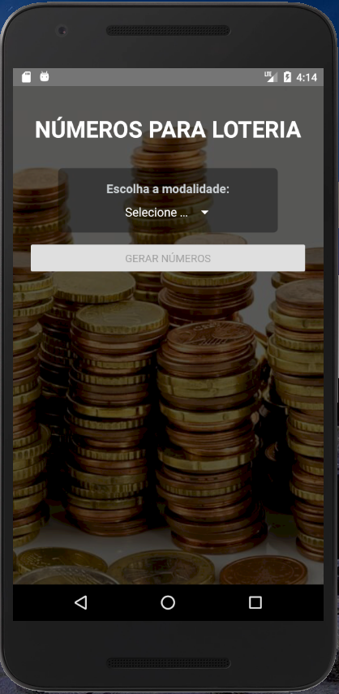

# App to generate random numbers to play in the lottery :four_leaf_clover:

 

 

This is a mobile application that aims to generate random numbers to play in the lottery.

 

## :hammer_and_wrench: Features:

:moneybag: The application starts with the button to generate the numbers disabled, and it's necessary for the user to first specify the game type of lottery (e.g. Mega-Sena) for which they would like to generate numbers.

:moneybag: Once the game type of lottery is selected, the option to choose the quantity of numbers to be generated will appear, considering that the minimum and maximum quantities of numbers vary according to the lottery game.

:moneybag: The default quantity of numbers displayed is the minimum quantity for the game type selected.

:moneybag: After selecting the lottery game type and the quantity of numbers, simply click the "Generate Numbers" button. Right below, a sequence of randomly generated numbers will be displayed in ascending order.

 

## :camera: Application images

  

 

 

  

 

## :man_technologist: Technologies and tools used:

- React Native
- Javascript
- Context API
- VS Code
- Emulador Android (Android Studio)

 

## :computer: Running the project locally:

To run this application on your local machine, I suggest downloading Android Studio to make use of the Android emulator and VS Code to edit the code.
Check the React Native documentation if your computer is set up and has all the necessary tools installed to run this project (https://reactnative.dev/docs/environment-setup).

 

Download or clone the project, and from the terminal, inside the application folder, execute the following commands:

 

1 - To download the dependencies:

### `npm install`

 

2 - To start the application:

### `npx react-native run-android`

  
  

Made with 🧡 and :coffee: | Find me on <a href="https://www.linkedin.com/in/vivianebresolin/"> LinkedIn</a>

